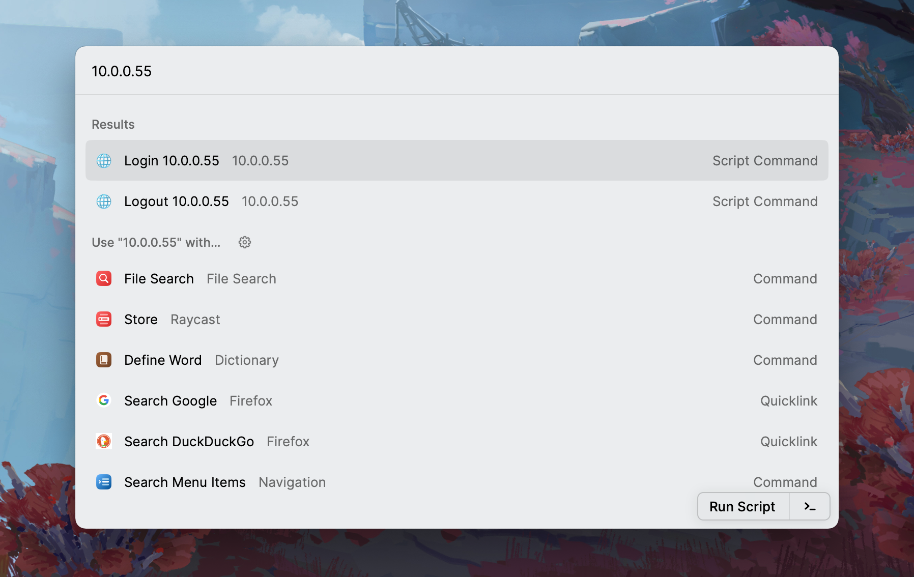

# bitsrun

> A headless login / logout script for 10.0.0.55 at BIT.

## Install

You need at least Python 3.7.

```bash
python -m pip install bitsrun
```

## Usage

### CLI

```bash
python -m bitsrun login -u|--username xxxx -p|--password xxxx
python -m bitsrun logout -u|--username xxxx -p|--password xxxx
```

Optional params:

- `-s|--silent`: No output what-so-ever.
- `-nc|--no-color`: No color in error or verbose output.
- `-v|--verbose`: Output verbose information including full response from the API.

### Config file

Either `/etc/bit-user.json` or `~/.config/bit-user.json`:

```json
{
    "username": "xxxx",
    "password": "xxxx"
}
```

```bash
python -m bitsrun login
python -m bitsrun logout
```

### Raycast script (macOS)



Import the two Raycast scripts from [`./scripts`](./scripts/) and setup your config file in `~/.config/bit-user.json`. The script uses `/usr/bin/python3` by default, so you either need to install `bitsrun` with this Python interpreter or setup your own Python interpreter path in the script.

<details>
<summary>Using networkmanager-dispatcher (deprecated).</summary>

### 使用 NetworkManager-dispacher

将 `bitsrun.py` 复制为 `/usr/bin/bit-login`，权限+x

将 `login-bit.sh` 复制到 `/etc/NetworkManager/dispatcher.d/`

将配置文件保存在 `/etc/bit-user.json`

start 并且 enable NetworkManager-dispatcher

</details>

## Developing

Install and run:

```bash
# Create virtual env and install deps
poetry install

# Enter poetry virtual env
poetry shell

# ... normal stuff with python -m bitsrun ...
```

Build:

```bash
# Building the wheel
poetry build
```

Publish:

```bash
poetry version 2.x.x
poetry publish
```

## License

[WTFPL License](LICENSE)
